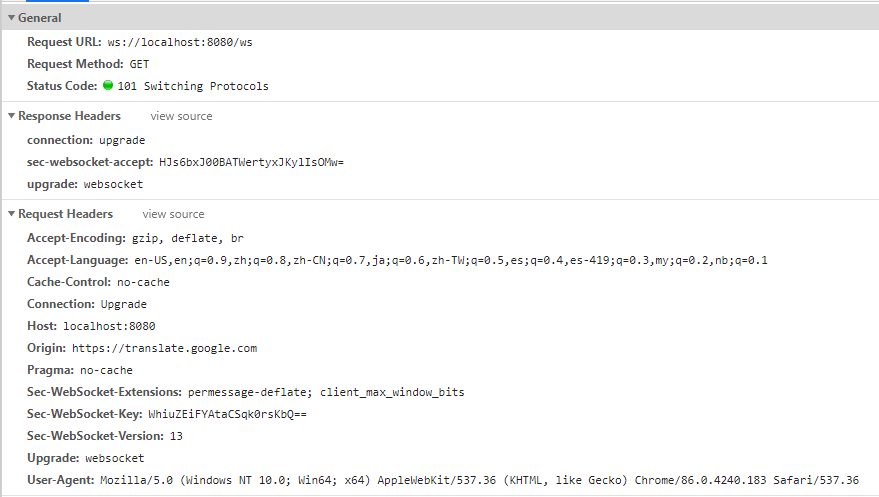

https://netty.io/news/

# Websocket弹幕

启动WebsocketBarrageServer

F12打开浏览器控制台, 输入

```javascript
var ws = new WebSocket("ws://localhost:8080/ws")
```

此时浏览器就会发起一个HTTP请求, 在Network里面可以看到

 

它在请求头里面加入:

* Upgrade: websocket

  告诉服务端要进行协议升级

* Sec-WebSocket-Version: 13

  协议版本

**备注:** 在控制台里面输入window.WebSocket, 如果有这个对象就表示浏览器支持Websocket

再访问http://localhost:8080, 发送弹幕

在刚刚的控制台里面可以为ws对象注册一个onmessage事件, 打印收到的消息

```javascript
ws.onmessage = function() {console.log(event.data);}
```

